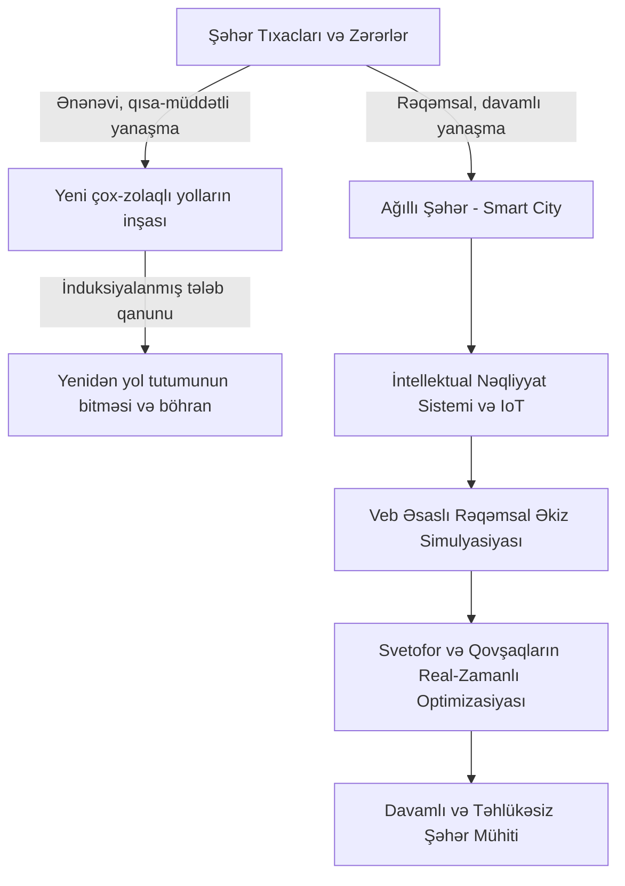
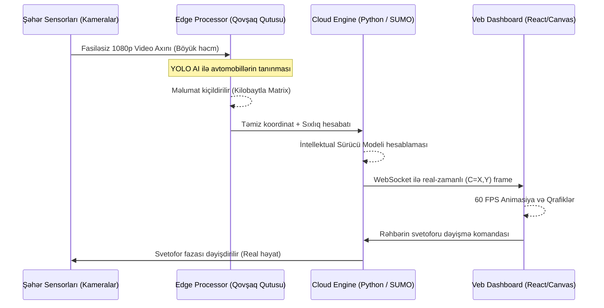

# FƏSİL I. ŞƏHƏR NƏQLİYYAT SİSTEMLƏRİ VƏ MODELLƏŞDİRİLMƏNİN NƏZƏRİ ƏSASLARI (ƏDƏBİYYAT İCMALI)

XXI əsrin əvvəllərindən etibarən qlobal miqyasda müşahidə olunan ən mühüm demoqrafik proseslərdən biri intensiv urbanizasiyadır. İnsanlar iqtisadi, mədəni və sosial ehtiyaclarını daha effektiv təmin etmək məqsədilə iri şəhər mərkəzlərinə cəmləşmişlər. Xüsusən inkişaf etməkdə olan ölkələrdə meqapolislərin (məsələn, Bakı, Mumbay, İstanbul, Mexiko və s.) hüdudsuz genişlənməsi şəhər infrastrukturunun, xüsusən də nəqliyyat tutumunun ehtiyaclarının dəfələrlə çoxalmasına səbəb olmuşdur. Lakin bu müsbət iqtisadi dinamika, özü ilə bərabər həyati əhəmiyyət daşıyan şəhər qan damarlarında – nəqliyyat sistemlərində misli görünməmiş gərginliklər və böhranlar (fasiləsiz tıxaclar) yaratmışdır. Aşağıdakı alt-fəsillərdə, bu ümumbəşəri problemin nəzəri kökləri, əvvəlki dövrlərin tədqiqatçıları tərəfindən tətbiq olunmuş həllər, müasir Rəqəmsal Əkiz (Digital Twin) texnologiyalarının təhlili, məlumat toplama sensorikası və nəhayət riyazi modelləşdirmə üsulları (xüsusən mikroskopik hərəkət tənlikləri) çoxşaxəli, hibrid şəkildə analiz edilmişdir.

## 1.1 Müasir şəhərlərdə nəqliyyat tıxacları problemi, iqtisadi və ekoloji təsirlər

Şəhər tıxacları təkcə yolda keçirilən passiv zaman itkisi deyildir; o həmçinin işçi qüvvəsinin səmərəliliyinə zərbə vuran, cəmiyyətin psixoloji rifahını aşağı salan, avtomobillərin daxili yanma mühərriklərindən (İCE - Internal Combustion Engines) çıxan karbon qazı ($CO_2$) və azot oksidi ($NO_x$) səviyyəsinin kəskin artmasına, eləcə də şəhər tədarük zəncirlərinin gecikməsinə səbəb olan ciddi, strukturlaşdırılmış böhrandır. Tarixən dövlət planlaşdırıcıları tıxacların həlli yolu kimi daim köhnə yanaşmalardan – yeni, daha enli yolların çəkilməsindən, alternativ tunellərin və çoxmərtəbəli beton estakadaların inşasından istifadə etmişlər.  
Lakın, iqtisadçı Anthony Downs tərəfindən hələ 1990-cı illərin əvvəllərində təklif olunan fundamental qanunauyğunluqlara əsasən, bu cür əlavə zolaqların tikintisi yalnız müvəqqəti və "aldadıcı sakitlik" gətirir [1]. Xüsusilə nəqliyyat elmində sübuta yetirilmiş **"İnduksiyalanmış tələb" (Induced / Latent demand)** prinsipi onu diktə edir ki, hər hansı inşası bitmiş, asanlaşdırılmış yeni yol eyni zamanda marşrutunu dəyişib o yola daxil olan daha çox yeni avtomobil qüvvəsini (hansı ki əvvəllər avtobusla və ya başqa yolla gedirdi) cəlb edir. Bu isə riyazi olaraq cəmi 1-2 ildən sonra həmin böyük infrastrukturun da tıxanmasına səbəb olur [9]. 

Tıxacların qlobal iqtisadiyyata vurduğu ziyanlar bir neçə parametr əsasında qiymətləndirilir:
*   Yanmayan (boşa xərclənən) yanacaq itkisi.
*   İnsanların iş saatlarında istehsal edə biləcəkləri itirilmiş gəlirlər.
*   Logistika və yük daşımalarının ləngiməsindən yaranan tarif artımları.
Amerika Birləşmiş Ştatlarında INRIX məlumatlarına əsasən böyük şəhərlərdəki adi bir sürücü ildə təqribən 99 saatını məhz tıxacda itirir və bu, milli iqtisadiyyata milyardlarla dollar "məhsuldarlıq cəriməsi" kəsir. Deməli, infrastrukturun betonla böyüdülməsi həll deyilsə, onu *intellektlə*, *rəqəmsallaşdırma ilə* və *optimizasiya ilə* böyütmək yeganə mühəndislik həllidir.

## 1.2 "Ağıllı Şəhər" (Smart City) konsepsiyası və Nəqliyyat İdarəetməsi

"Ağıllı Şəhər" 2000-ci illərin ortalarında (xüsusilə nəhəng texnologiya konserni IBM tərəfindən irəli sürülən "Smarter Planet" konsepsiyasından inkişaf taparaq) akademik aləmə daxil olmuş inqilabi bir şəhərsalma fəlsəfəsidir [8, 12]. Şəhərin komponentlərinin – nəqliyyat axınlarının, küçə işıqlandırılmasının, su təchizatının – bir-biriylə ünsiyyət quran İnformasiya və Kommunikasiya Texnologiyaları (İKT), eləcə də Əşyalar İnterneti (IoT) şəbəkəsi vasitəsilə mərkəzləşdirilmiş şəkildə idarə edilməsi Smart City-nin təməlidir. 

Smart City konsepsiyasını müxtəlif alimlər 6 əsas komponentə bölmüşdür: Smart Mobility (Ağıllı Hərəkətlilik), Smart Environment (Ağıllı Çevrə), Smart Governance (Ağıllı Dövlət idarəçiliyi), Smart Living (Ağıllı Yaşam), Smart Economy (Ağıllı İqtisadiyyat) və Smart People. Bu altı böyük şaxənin mərkəzi generatoru məhz **Smart Mobility - İntellektual Nəqliyyat Sistemləridir (İNS)**.
İNS mürəkkəb riyazi alqoritmlərə sahib prosessorlar toplusu olub, işıqforları statik deyil, yoldakı fərdlərin (avtomobillərin) sıxlığına avtomatik uyğunlaşdırır (Adaptiv Traffic Signal Control). Covid-19 pandemiyası (qapanmalar və idarəetmə sıxıntıları) zamanı məlumat paylaşım standartlarının xüsusilə Smart City konsepsiyasını necə cəlbedici etdiyi və şəhərsalma problemlərini azaltdığı aydın olmuşdur [19]. 

**Şəkil 1.1:** *Ənənəvi nəqliyyat inşasından fərqli olaraq Smart City arxitekturasına (Rəqəmsal Əkiz) keçidin qrafik məntiqi.*

## 1.3 Nəqliyyat Sistemlərində Məlumat Toplama (Data Acquisition) Mexanizmləri

Simulyasiya, o cümlədən İntellektual Sistemlərin ən əsas "yanacağı" düzgün, dəqiq və kəsilməz yerdən (Local nodes) gələn datadır. Rəqəmsal bir sistem reallıqdakı (Physical System) maşın sayını oxuya bilmirsə, heç bir xəritə və hesablama fayda verməz. Buna görə də "Ağıllı Şəhərlərdə" sensorlar böyük texnoloji töhfə verir. Aşağıda ən geniş yayılmış 4 əsas məlumat toplama texnologiyası təhlil edilmişdir:

**1. İnduktiv İlmələr (Inductive Loop Detectors)**
Yer altı (asfalt qatı daxilinə) çəkilmiş xüsusi maqnit yaradan metal kabellərdən ibarətdir. Yuxarıdan metal kütlə (avtomobil) keçdiyi zaman asılı qalan dalğa tezliyi (induktivlik) kəskin dəyişir. Bu dəyişiklik mikrokontrollerə impuls olaraq göndərilir və 1 avtomobil kimi qeydə alınır. Ən ucuz standart həlldir, lakin asfaltın erroziyasından tez-tez xarab olur və sadəcə 0-1 (üstümdə maşın var və ya yoxdur) məntiqi verir, növünü ayıra bilmir.

**2. Kameralar və Kompüter Görməsi (Computer Vision / AI Video Detection)**
Qovşaqların üstündə asılan İP kameralar real zamanlı yüksək kadr (FPS) ötürür. Bulud texnologiyasındakı AI neyron şəbəkələri (məs. YOLO - You Only Look Once və ya Haar Cascades) kadrdakı hər bir bloku analiz edərək həm maşını sayır, həm onun növünü (avtobus, qür qaldıran avadanlıq, sedan), həm də vektor sürətini təyin edir. Hazırda dünyada dominant texnologiyaya çevrilməkdədir, lakin yağışlı və dumanlı hava şəraitində işıq qırılması səbəbindən ani korluq (algoritmik xəta) yaşaya bilirlər.

**3. Üzən Avtomobil Məlumatları (Floating Car Data - FCD və GPS)**
Bu texnologiya ümumiyyətlə heç bir küçə infrastrukturuna ehtiyac duymur. İqlimdən asılılığı yoxdur. Sürücünün özünün istifadə etdiyi Google Maps, Yandex və ya GPS modulları vasitəsilə 2-3 saniyədən bir peykə öz coğrafi koordinatını $(X, Y, Speed)$ göndərir. Əgər eyni küçədən peykə gələn 50 ayrı telefonun hərəkət sürəti saatda 5 km-dirsə, mərkəzi server (Edge / Cloud) ani qərar verir ki, o küçədə dəhşətli sıxlıq var və həmin küçəni xəritədə "qırmızı" xətlə rəngləyir. Lakin bu yanaşma avtomobili bir "nöqtə" kimi görür, qovşağa çatan insanın saniyəlik manevr izləməsini verə bilmir.

**4. LiDAR, Radar və İnfraqırmızı (IR) Sensorlar**
Xüsusilə qəza qeydiyyatları üçün və pis hava şəraitində işıqforları dəyişmək üçün 3D lazer (LiDAR) tətbiq olunur. Nəqliyyat tədqiqatlarında LiDAR hərəkət edən obyektin bulud nöqtəsini (Point Cloud) çıxarır. Radarlar approaches vasitəsilə sürət kameralarının əsasıdır (Doppler effekti). Bu datchiklər xüsusən mikro-simulyasiya üçün ən təmiz "Gap" (ara məsafəsi) məlumatlarını təchiz edirlər. Rəqəmsal Əkiz modellərində sistem daim sensorlardan alınan bu 4 müxtəlif hibri dataya inteqrasiya yaratmağa məcburdur [15].

## 1.4 "Rəqəmsal Əkiz" (Digital Twin) Texnologiyası və Edge-Cloud Arxitekturası

Rəqəmsal Əkizin tam riyazi işləməsi əslində fiziki aləmlə kompüter aləminin əbədi güzgüsüdür. Rəqəmsal Əkiz orijinal olaraq aerokosmik sənayedən və mürəkkəb istehsalat sferasından (xüsusən NASA Apollon uçuşlarında simulyasiya təhtəlşüuru kimi) gələrək [13], dövrümüzdə mürəkkəb real dünya sistemlərinin – şəhərin məkan şəbəkəsinin virtual surətinə tətbiqini tapmışdır. Professor Grieves tərəfindən iddia edildiyi kimi "Fiziki, Virtual və onlar arasındakı Əlaqə" Digital Twin-in yeganə qaydasıdır. 
Bu obyektlər (məsələn, svetoforlar, kəsişmələr, istiqamətləndirici lövhələr) üzərində böyük maliyyə itkiləri olmadan, virtual mühitdə 100 illik ehtimalları cəmi saniyələr içərisində yoxlamağı mümkün edir. 

**Nəqliyyatda "Edge-Cloud Continuum" (Kənar-Bulud Birləşməsi)**
Şəhər mühitində 100 000-dən artıq avtomobilin eyni anda kordinatını, tormozlamasını simulyasiya etmək qeyri-adi dərəcədə böyük CPU (hesablama) resursu tələb edir. Əgər hər sensordan gələn bütün milyonlarla məlumat Mərkəzi dövlət serverinə qədər birbaşa axarsa, şəbəkələrdə (Latency - Gecikmə) dözülməz darboğaz (Bottleneck) yaşanar. Müasir elmi mənbələr, o cümlədən Zhang et al. (2021) "Edge-cloud continuum" anlayışını gündəmə gətirərək, bu kütlənin mərkəzi şəbəkələri bloklamasının qarşısını almağı təklif etmişlər [20, 21].
Bu arxitekturaya əsasən hesablamalar 3 böyük topoloji qat (Layer) üzrə paylanır:

1.  **Cihaz və ya IoT qatı (Sensors/Actuators):** Küçələrdə olan fiziki kameralar (Edge xüsusiyyəti olmayan) fasiləsiz video kadrlarını yaxınlıqdakı qutuya ötürür.
2.  **Kənar (Edge) qatı (Fog/Edge Computing):** Təsəvvür edək ki, hər 4 qovşaqdan bir yol kənarında kiçik qutu (məs: NVIDIA Jetson və ya kiçik Raspberry Serveri) qoyulub. Bu kompüterlər böyük video datanı deşifrə edib ancaq "Say və Sürət" nəticəsini mətn kimi alır. Yəni videonun (Geqabaytlarla ölçülə bilən datanın) Mərkəzə getməsinin qarşısını alıb onu kiçik (Bir neçə Kilobayt) həcmlə Mərkəzə yönləndirir. 
3.  **Bulud (Cloud / Backend) qatı:** Mərkəzi server məhz yüngülləşmiş dataları yığır, Rəqəmsal Əkizin Python mühərriklərini hərəkətə keçirir, riyazi fərziyyələr yaradır, marşrutları dəyişdirir və IDM mikroskopik simulyasiyasına tabe etdirir.
4.  **Veb İnterfeys (Frontend Dashboard):** Yekun istifadəçinin brauzeri vasitəsilə 2D/3D (WebGL) animasiya ilə mərkəzdən çəkdiyi dataları qüsursuz işlədir.

**Şəkil 1.2:**  *Kənar-Bulud (Edge-Cloud) Rəqəmsal Əkiz arxitekturasının məlumat axını və qərar qəbuletmə mexanizminin sinxron iş prinsipləri.*

## 1.5 Nəqliyyat axınlarının riyazi və kompüter modelləşdirilməsi metodları

Kompüter daxilində şəhər küçələrindəki nəqliyyat qanunauyğunluqlarının formalaşdırılması çoxistiqamətli funksiyalara əsaslanır və kəsrli asimptotik riyazi tənliklərlə ifadə olunur [11]. Elm dünyasında trafik simulyasiyası abstraksiya dərəcəsinə (insanat bənzəmə böyüklüyünə) görə üç makro-kateqoriyaya bölünür [7, 18]:

### 1.5.1 Makroskopik Modellər

Nəqliyyat axınına sanki borudan axan maye (hidro-dinamika qanunları) kütləsi kimi yanaşır. Hər bir avtomobil, onun sürücüsünün manevri, markası, yaşı və sürətlənmə anı nəzərə alınmır. Yol daha çox ümumi intensivlik ($q$ - saniyədən keçən maşın sayı), sıxlıq ($k$ - kilometrə düşən maşın kütləsi) və məkan-orta sürəti ($v$) meyarları üzrə böyük şəbəkə miqyasında ölşülür. Lighthill-Whitham-Richards (LWR modeli) adlanan 1950-ci illərin elmi əsası bu sahənin konstitusiyası hesab edilir. Bu qanun sırf kütlənin saxlanması (Conservation of Mass) nəzəriyyəsidir:
$$\frac{\partial k}{\partial t} + \frac{\partial q(k,x,t)}{\partial x} = 0$$

Burada, yolun hər hansı elementindən gələn maşın mütləq şəkildə yoxa çıxa bilməz (təbii ki avropa ssenarisidir, tətbiqdə "source" və "sink" - giriş və çıxış nöqtələri təyin olunmalıdır). Lakin Makroskopik model kəsişmədə fərdin dayandığını ehtiva etmir deyə, dəqiq "Ağıllı Şəhər" təhlili aparmaq üçün demək olar ki praktik korluluq yaşadır [3].

### 1.5.2 Mezoskopik Modellər

Makroskopik modelin böyüklüyü ilə, mikroskopik modelin nöqtəvi dəqiqliyini balanslaşdırmağa çalışan model fəlsəfəsidir. Obyektlərə baxış fərdi yox, maşın "paketləri" (Platoon) yaxud "karvanları" formatındadır [4]. Məsələn, 5 maşınlıq bir kolonna bir hüceyrə sayılır və riyazi ehtimal hesablamaları yalnız bu "hüceyrə qrupuna" aid edilir. Mezoskopik modellər böyük fəza diapazonlarında logistik marşrutlandırma (Routing System) qərarlarının verilməsində çox sürətli çalışırlar. Ancaq bu sistem real Dashboard simulyasiyasına və ya oyuna (avtomobillərin konkret künclərdən dönmə animasiyasına) heç bir vizual zəmin yaratmır.

## 1.6 Mikroskopik Modellər: İntellektual Sürücü Modeli (IDM)

Dövrümüzün ən geniş istifadə olunan, mikroskopik yanaşmadır. Burada obyekt qrup şəklində yox, fərd səviyyəsində sistemin mərkəzində dayanır. Hər bir avtomobil (Agent) öz uzunluğuna (məsələn, yük maşını $15m$, yüngül maşın $4,5m$), mühərrik növünə, aqressivlik indeksinə malikdir. Bu fərdlər Newton mexanikasına uyğun olaraq məkan və zaman ($x(t), v(t)$) ölçülərində hərəkət edir. Şəhər tıxaclarını həll edəcək vizuallıq və qovşaq (svetofor) sıxlıqlarını hesablamaq yalnız bu modellə mümkündür. 

Lakin sistemdə yüzlərlə sərbəst agentin hərəkət etməsi "Virtual Toqquşmalara" gətirib çıxara bilər. Ona görə də cəmiyyətdə təhlükəsizlik əsaslı "Avtomobil-izləmə" (Car-Following) prinsipindən istifadə olunur. Elm dünyasında toqquşma ehtimalını riyazi olaraq "0"-a endirən, insan tormozlama hissini mükəmməl təsvir edən qanun **İntellektual Sürücü Modelidir (IDM - Intelligent Driver Model)** [2]. M. Treiber tərəfindən inkişaf etdirilən bu formul, sürücünün önündəki maneəyə görə saniyəbəsaniyə qərar verdiyi mənfi/müsbət təcili izah edir. 

Model aşağıdakı diferensial bərabərliyi ehtiva edir (Hər *n*-ci avtomaşına xas olan anlıq sürətlənmə tənliyi):
$$ \frac{dv_n}{dt} = a \left[ 1 - \left( \frac{v_n}{v_0} \right)^\delta - \left( \frac{s^*(v_n, \Delta v_n)}{s_n} \right)^2 \right] $$

Burada ən həyati hesablamanı "dinamik arzuolunan minimal təhlükəsizlik məsafəsi" ($s^*$) düsturu təşkil edir. O, önündəki $n-1$ nömrəli maşınla olan sürət fərqinə ($\Delta v_n / approaching rate$) əsasən sıxılmanı anından yaradır:
$$ s^*(v, \Delta v) = s_0 + v T + \frac{v \Delta v}{2\sqrt{ab}} $$

İzahlı şəkildə asılılıqların və kəmiyyətlərin parametrik (insani) analizi:
1.  **$v_0$ (Hədəf və ya arzuolunan sürət):** Əgər sürücünün qarşısı tamamilə açıqdırsa ($s_n \to \infty$) çatmaq istədiyi hədəf sürət həddi.
2.  **$T$ (Təhlükəsiz zaman buferi):** Qabaqdakı avtomobillə idarəolunan təhlükəsiz anlıq məsafə saniyəsi. Adi psixologiyada bu, reaksiyanın 1-1.5 saniyə gecikməsini kopiyalasın diyə daxil edilir. Yüksək sürətdə təhlükəsiz aralıq məsafəsi dinamik artır.
3.  **$s_0$ (Statik minimum qapalı məsafə):** Qırmızı işıqda və ya tam dayanan (Tıxac) avtomobillər arasında qorunan məcburi bamper məsafəsi (adətən 2.0 metr stuxnasiya zonası).
4.  **$a$ (Maksimal müsbət sürətlənmə):** Qaz pedalının sərt sıxılmasını göstərir. Tıxac bitdiyi an verilən reaksiya.
5.  **$b$ (Rahat yavaşlama - deceleration):** Əyləc pedalının sıxılmasındakı normal, qorxutmayan yavaşlama limiti. IDM yalnız son çarə kimi bu limiti keçir (toqquşmamaq üçün böyük ehtiratsızlıq olanda zəncirvari sınma baş verir).
6.  **$\delta$ (Sürətləndirmə üstlüyü əmsalı):** Adətən rəqəmi $\delta=4$ götürülür. Mənası odur ki, avtomobil arzulanan sürətin ($v_0$) yalnız tam 90%-nə çatdıqdan sonra yumşalmağa və axarına qovuşmağa ($v \approx v_0$) başlama ehtiyacı hiss edir. 

Eyni zamanda, bu sistem yalnız qaz/əyləcdən deyil, idarəetmədən (ruldan - Steer) əmələ alan dəyişimlər tələb etdiyi üçün, MOBİL adlandırılan fəza-zolaq dəyişmə modelindən də ayrılmaz hissə kimi yararlanır [5, 14].

## 1.7 Nəqliyyat Simulyasiyalarında Marşrutlandırma (Routing) Alqoritmləri

Rəqəmsal bir maşın yalnız avtomatik olaraq digərini izləmir (Car-Following), eyni zamanda şəhər xəritəsində qovşaqdan qovşağa hansı istiqamətlə gedəcəyini də öncədən və ya mütəmadi təyin etməlidir. Buna **Routing** (Marşrutlandırma) problemi deyilir. Qraf nəzəriyyəsində hər bir kəsişmə bir Nöqtə (Node / Vertex), küçələr isə Kənar (Edge) hesab olunur. Tıxacı modelləşdirmək üçün 2 fərqli qərar qəbul etmə alqoritmləri işə salınır:

**Dijkstra və A* (A-Star) Algoritmləri:** Klassik naviqasiyaların (köhnə pleyerlərin) ən qəddar metodlarıdır. Dijkstra, "A" nöqtəsindən "B"-yə olan ən qısa kənar-ağırlığını ($w(u,v)$) tapmaq üçün sistemdəki bütün yollarda potensial qiymət hesablayır. Çox vaxt və resurs çəkir. A* (A-star) isə Hevristika ($h(x)$) funksiyasından istifadə edərək yalnız və yalnız hədəf bünövrəyə (B) yaxınlaşan yollara baxır, yəni əks yolları hesablamadan kənara atır, buna görə minlərlə dəfə daha sürətlidir. 

**Dinamik (DOD - Dynamic Open Data) və Stoxastik Marşrutlandırma:** Rəqəmsal Əkiz olanda əliyalın A* (A-star) kifayət eləmir. Çünki, şəbəkə dinamikdir - küçə 5 dəqiqə əvvəl boş ola bilər, ancaq qəfləti qəza nəticəsində "ağırlıq əmsalı" sonsuzluğa doğru artar. Rəqəmsal simulyasiyalar *Yenidən qərarlama (Rerouting)* addımlarını tsikl ilə tətbiq edir ki, avtomobillər sıxlıq gördükdə ssenarinin ortasında sükanlarını digər prospektlərə qıvıra bilsinlər. Bu da simulyasiyada əsl xaos mexanikasını canlandırmağa səbəb olur.

## 1.8 Mövzu üzrə aparılmış əvvəlki tədqiqatlar və Simulyasiya Platformalarının analizi

Dunya miqyaslı bazalarda (Scopus) edilən qlobal tədqiqat icmalları nəqliyyat simulyatorları sahəsində mövcud proqramların necə nəhəng olduğunu, lakin eyni dərəcədə aydın "mənfəət boşluqları" verdiyini nümayiş edir [6, 18]. Kommersiya və tədqiqat sferasında mütləq üstünlüyə malik klassik alətlər əsasən aşağıdakılardır:

- **SUMO (Simulation of Urban MObility):** Almaniya Aerokosmik Mərkəzi (DLR) tərəfindən idarə olunan (2001-dən bəri) tam açıq mənbəli mühərrikdir. Böyük fəza, şəhər xəritələrini (OpenStreetMap) mükəmməl tanıyır. Pleyeri var, lakin o qədər ağır və C++ ssenari tipli komanda xətti (CLI) quruluşuna sahibdir ki, təsadüfi bir ziyarətçinin onu Veb kimi istifadə etməsi qeyri-mümkündür. Modifikasiya etmək üçün Python TraCI (Traffic Control Interface) paketindən istifadə olunur [10]. Lakin bu bağlantı Socket arxitekturasında güclü ləngimələr və CPU (Local Server) yükü yaradır.

- **PTV VISSIM:** İqtisadi cəhətdən kommersiya lisenziyaları ilə məhdudlaşdırılan, çox səliqəli və "Windows-UI" xüsusiyyətinə malik, heyrətamiz hesablamalı mikroskopik həlldir. Akademik tədqiqatlarda ən etibarlı real göstərici verən tətbiqlərdəndir [7]. Lakin maliyyə tələbləri, böyük qurğular və lokal asılılıq səbəbindən "şəbəkə rəhbərinin qaput altında anında girib baxa bilməsi" anlayışına dəyər qatmır.

**Süni İntellektlə (AI) Tıxac Simulyasiyalarında "Yeni Qat"**
Son illərdə məsələ klassik fiziki düsturlardan daha da irəliyə gedib. Chen et al., El Saddik və digər sənaye liderlərinin 2023 və 2024-cü illərdə (AI hype-ı fonunda) etdiyi innovativ hesabatlar aydınlaşdırır ki, Simulyasiya Mühərriklərinin üstünə bir də "Neyron Şəbəkələri" (Neural Networks) Agentləri qoyulmalıdır [15, 21]. Yəni işıqfor fazasını artıq riyaziyyatın saniyə sayğacı deyil, Gücləndirməli Öyrənmə (Reinforcement Learning (RL) - məsələn Q-Learning) təyin edir. RL agenti minlərlə virtual toqquşma ehtimalını öz cərimə funksiyasına (Penalty) çevirərək elə bir yaşıl işıq dalğası açır ki, adi riyaziyyat ondan aciz qalır [22].

## 1.9 Veb-əsaslı (WebGIS) Mühitlərə olan Zəruri Ehtiyac (Problem Qoyuluşı)

Mövcud akademik irəliləyişlərə rəğmən cəmiyyətdə intellektual idarəetmə sistemlərinin kütləvi cəlb olunması yönündə əhəmiyyətli dərəcədə praktik pərvəzlənmə yerləri və tədqiqat boşluqları qalmaqdadır:

1.  **Masaüstü (Desktop) Qəfəsi və Miqyaslanma Darboğazı:** Yuxarıdakı fəsillərdən məlum olduğu üzrə, cəmiyyətin istifadə etdiyi alətlərin böyük mütləqiyyəti cihaz asılılıqlı (OS-Native) lokal proqramlardır. İdarəçi qovşağı izləmək üçün "Exe" icrası ilə VISSIM/SUMO platformasını notbukunda açmalı, dəqiqələrlə hesablama aparmalıdır [20]. Xəritədəki agent sayı on minlərlə olduqda (Bakı kimi meqapolislərin qaçılmaz ehtiyacları olan böyük məlumat bazası) FPS (saniyədə vizual kadr sayı) çökür və istifadəçi ekranı tam donur.
2.  **Dashboard İnsan/Texnika Uçurumu:** Dövlət nümayəndələrinə, mer idarələrinə vacib olan şey "TraCI C++ klasslaşdırması" və ya XML faylları kodlamaq deyil. Onlara zəruri olan tək tablodur: *Dashboard*. Dünyanın hər yerindən smartfon və ya adi ofis kompüteri vasitəsi ilə daxil olunacaq Brauzer daxilində (Chrome/Safari) tam anlaşıqlı rəngli xəritə, "Svetoforlara Toxun və İdarə et" modulları və real-zamanlı simulyasiya görüntüsü. Buna WebGIS təkəliyi deyilir.

**WebSocket və WebGL Cavabı:** Bu tədqiqat boşluğunu ləğv etmək məqsədi daşıyan Rəqəmsal Əkiz layihəmiz, Backend mühərrikində (buludda) olan bütün böyük fiziki tənliklərin nəticəsini Veb Brauzerə fasiləsiz gətirmək üçün Event-Driven (Hadisə İdarəli) WebSocket kanallarından istifadə edir. Veb mühitində, Brauzer daxilində şəkil (Kadr) xəritəsini isə HTML5 Canvas-ı deyil, birbaşa Qrafik Kartdan (GPU) faydalanan WebGL (2D/3D interfeys) və React arxitekturası təşkil edəcək [18]. Bu, müasir elmdə heç bir ağır masaüstü avadanlıq olmadan minlərlə avtomobili Brauzerdə hamar uçurda bilən mükəmməl asanlıq və inqilab hesab olunur.

## 1.10 Dünya Təcrübəsindən Rəqəmsal Əkiz Nümunələri (Case Studies)

Təsadüfi deyil ki, Web və Rəqəmsal Əkiz inteqrasiyası dövlətlərin ən böyük gələcək vizyonlarıdır [13, 17]. Dünya miqyasında "Veb Dashboard" əsaslı Şəhər izləmələrinə ən fundamental iki nümunə mövcuddur:
*   **Virtual Sinqapur (Virtual Singapore):** Dassault Systèmes tərəfindən proqramlaşdırılıb dövlətə verilmiş layihə. Şəhərin təkcə həndəsi quruluşunu deyil, real vizual nəqliyyat qovşaqlarını özündə əks etdirərək dövlət memarlarına və Nəqliyyat İdarəsinə Web mühitindən daxil olmağa fürsət tanıyır. Təsadüfi hava şəraiti, kütləvi izdiham hadisələri zamanı avtomobil böhranını idarə edir.
*   **London "Tıxac Bölgəsi" (Congestion Charge Zone):** Londondakı kameraların böyük Məlumat Mərkəzləri ilə fasiləsiz kommunikasiyası, şəhərin fərqli bölgələrinə rəqəmsal ödəniş zonaları ayırmış və simulyator hesabına "haraya nizamlanmış nəzarət qoyulacaq" qərarlarını sadə planlama monitorundan təmin edir. Bütün rəhbərlər Web ekranla anbaan şəhərə axan stoxastik naxışları (Pattern) incələyə bilirlər.

## 1.11 Fəsil üzrə Nəticə

Yekun olaraq vurğulamaq lazımdır ki, şəhər tıxacları probleminin iqtisadi, psixoloji və ekoloji divarlarını yıxacaq ən ideal və rasional həll yolu Rəqəmsal Əkiz anlayışından bəhrələnən "Ağıllı Şəhər / İNS" modelidir. Xronoloji ədəbiyyat icmalı onu bir daha riyazi olaraq təsdiqləyir ki, hesablamalarda fərdlərin hərəkət qaydaları - İntellektual Sürücü Modeli (IDM) fizikanın ən doğru yanaşmasıdır. Lakin mövcud proqram paketlərinin hamısı universitet tədqiqatlarına və ağır mühəndis laboratoriyalarına daxili kod kimi bağlanmışdır. İnformasiya əsrinin əsl rəqabəti - Rəqəmsal Əkizlərin bulud vasitəsilə Backend serverə atılması, hər hansı bir sənəd yükləməsi və ya 3D oyun resursu qurulması tələb etmədən xəritə interfeysini dərhal adi istifadəçi və dövlət rəhbərləri üçün "Veb Dashboard/Frontend" formatında canlandırmasıdır. Mövcud tədqiqat layihəsinin əsas mühəndis hədəfi məhz sadalanan əskiklikləri Rəqəmsal asanlıqla (Python-React konfiqurasiyası ilə) örtərək praktik obyekti mühərrik səviyyəsində işləyib hazırlamağa zəmin yaradır.

## İSTİFADƏ EDİLMİŞ ƏDƏBİYYAT SİYAHISI

1. Downs, A. (1992). *Stuck in traffic: Coping with peak-hour traffic congestion*. Brookings Institution Press.
2. Treiber, M., Hennecke, A., & Helbing, D. (2000). Congested traffic states in empirical observations and microscopic simulations. *Physical Review E*, 62(2), 1805.
3. Mahmassani, H. S. (2001). Dynamic network traffic assignment and simulation methodology for advanced system management applications. *Networks and Spatial Economics*, 1(3), 267-292.
4. Burghout, W., Koutsopoulos, H. N., & Andréasson, I. (2005). Hybrid macroscopic-microscopic traffic simulation. *Transportation Research Record*, 1934(1), 218-225.
5. Kesting, A., Treiber, M., & Helbing, D. (2007). General lane-changing model MOBIL for car-following models. *Transportation Research Record*, 1999(1), 86-94.
6. Kotusevski, G., & Hawick, K. A. (2009). A review of traffic simulation software. *Research Letters in the Information and Mathematical Sciences*, 13, 35-54.
7. Barceló, J. (2010). *Fundamentals of Traffic Simulation*. Springer.
8. Harrison, C., et al. (2010). Foundations for smarter cities. *IBM Journal of Research and Development*, 54(4), 1-16.
9. Duranton, G., & Turner, M. A. (2011). The fundamental law of road congestion: Evidence from US cities. *The American Economic Review*, 101(6), 2616-2652.
10. Krajzewicz, D., Erdmann, J., Behrisch, M., & Bieker, L. (2012). Recent development and applications of SUMO – Simulation of Urban Mobility. *International Journal On Advances in Systems and Measurements*, 5(3–4), 128–138.
11. Vlahogianni, E. I., Karlaftis, M. G., & Golias, J. C. (2014). Short-term traffic forecasting: Where we are and where we’re going. *Transportation Research Part C*, 43, 3–19.
12. Neirotti, P., De Marco, A., Cagliano, A. C., Mangano, G., & Scorrano, F. (2014). Current trends in Smart City initiatives: Some stylised facts. *Cities*, 38, 25-36.
13. Grieves, M., & Vickers, J. (2017). Digital twin: Mitigating unpredictable, undesirable emergent behavior in complex systems. In *Transdisciplinary perspectives on complex systems* (pp. 85-113). Springer.
14. Zhu, M., Wang, X., & Tarko, A. (2018). Modeling car-following behavior on urban expressways with consideration of the speed guidance. *IEEE Transactions on Intelligent Transportation Systems*, 19(8), 2419-2428.
15. El Saddik, A. (2018). Digital twins: The convergence of multimedia technologies. *IEEE Multimedia*, 25(2), 87-92.
16. Rasheed, A., San, O., & Kvamsdal, T. (2020). Digital twin: Values, challenges and enablers from a modeling perspective. *IEEE Access*, 8, 21980-22012.
17. Fuller, A., Fan, Z., Day, C., & Barlow, C. (2020). Digital twin: Enabling technologies, challenges and open research. *IEEE Access*, 8, 108952-108971.
18. Zheng, J. (2020). Web-based traffic simulation and visualization for smart city applications. *Journal of Urban Technology*, 27(3), 67-85.
19. Allam, Z., & Jones, D. S. (2020). On the coronavirus (COVID-19) outbreak and the smart city network: Universal data sharing standards. *Smart Cities*, 3(2), 468-477.
20. Zhang, X., et al. (2021). Edge-cloud continuum for digital twins in intelligent transportation systems. *IEEE Network*, 35(6), 136-143.
21. Chen, Y., et al. (2023). Cloud-edge collaborative architecture for traffic digital twins. *IEEE Internet of Things Journal*.
22. Sayed, T., et al. (2024). Web-based traffic visualization using D3.js and modern WebGL frameworks. *Transportation Research Part C*, Advances in ITS.
