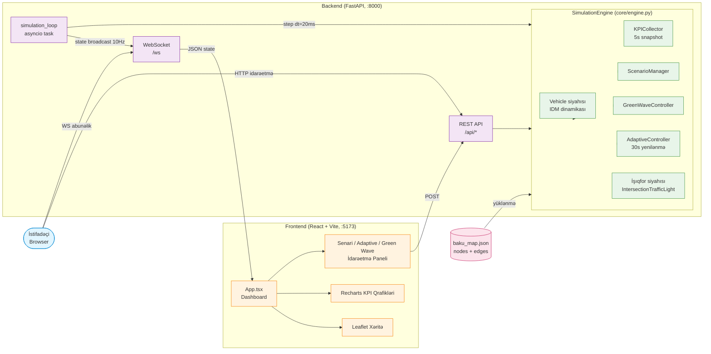
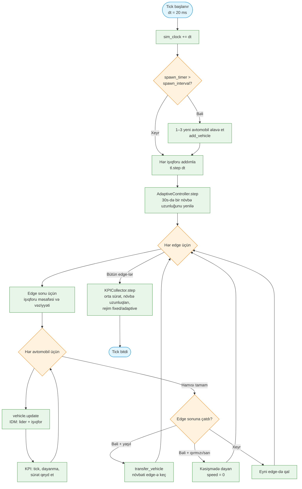
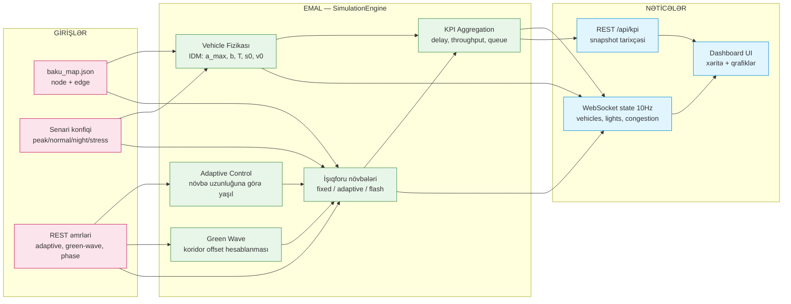
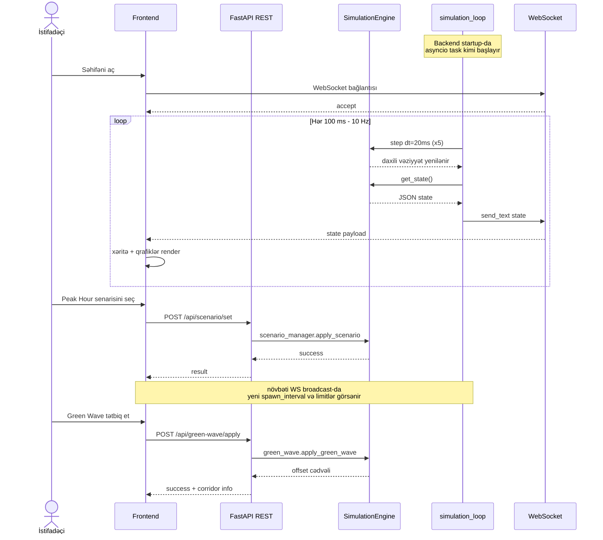

# Simulyasiya Arxitekturası

Bakı trafik rəqəmsal əkizi (digital twin) simulyasiyasının ümumi sxematik görünüşü.

- **Backend:** Python + FastAPI + asyncio (fizika 50 Hz, broadcast 10 Hz)
- **Frontend:** React 19 + TypeScript + Leaflet + Recharts
- **Rabitə:** WebSocket (real-vaxt vəziyyət) + REST (idarəetmə)

---

## 1. Yüksək Səviyyəli Arxitektura

İstifadəçi, frontend, backend və daxili modulların əlaqəsi.



> PNG: [diagrams/01_architecture.png](diagrams/01_architecture.png)

---

## 2. Simulyasiya Tick Loop (bir addımın daxili axını)

`SimulationEngine.step(dt)` metodunun ardıcıllığı — hər 20 ms-də bir.



> PNG: [diagrams/02_tick_loop.png](diagrams/02_tick_loop.png)

---

## 3. Məlumat Axını (Inputs → Processing → Outputs)

Konfiqurasiyadan istifadəçi ekranına qədər məlumat hərəkəti.



> PNG: [diagrams/03_data_flow.png](diagrams/03_data_flow.png)

---

## 4. Frontend ↔ Backend Sequence

İstifadəçinin senari dəyişməsi və canlı state alması ssenarisi.



> PNG: [diagrams/04_sequence.png](diagrams/04_sequence.png)

---

## Modul Cədvəli (sürətli istinad)

| Modul | Fayl | Məsuliyyət |
|-------|------|-----------|
| SimulationEngine | `backend/core/engine.py` | Master orkestrator: spawn, step, KPI, kəsişmələr |
| Vehicle (IDM) | `backend/models/vehicle.py` | Car-following dinamikası, işıqfora reaksiya |
| IntersectionTrafficLight | `backend/models/traffic_light.py` | Faza dövriyyəsi (fixed/adaptive/flash) |
| AdaptiveController | `backend/core/adaptive_controller.py` | Növbə uzunluğuna görə yaşıl vaxtı paylama (30s-də bir) |
| GreenWaveController | `backend/core/green_wave.py` | Koridorları aşkar et, faza offset-i tətbiq et |
| ScenarioManager | `backend/core/scenario_manager.py` | Peak/Normal/Night/Stress profilləri |
| KPICollector | `backend/core/kpi_collector.py` | delay, throughput, travel time, 5s snapshot |
| FastAPI App | `backend/main.py` | REST endpoints + WebSocket + simulation_loop |
| React App | `frontend/src/App.tsx` | Dashboard, xəritə, qrafiklər, idarəetmə |

---

## Diaqramları PNG kimi yeniləmək

```bash
cd simulation
npx -p @mermaid-js/mermaid-cli mmdc -i ARCHITECTURE.md -o diagrams/architecture.png
```

Hər diaqram üçün ayrıca `.mmd` fayl da `diagrams/` qovluğunda saxlanılır (yenidən render üçün).
